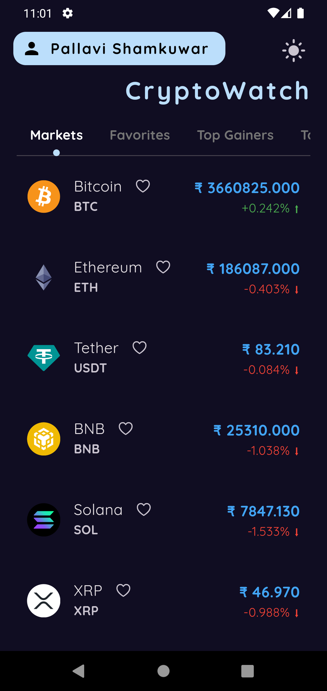
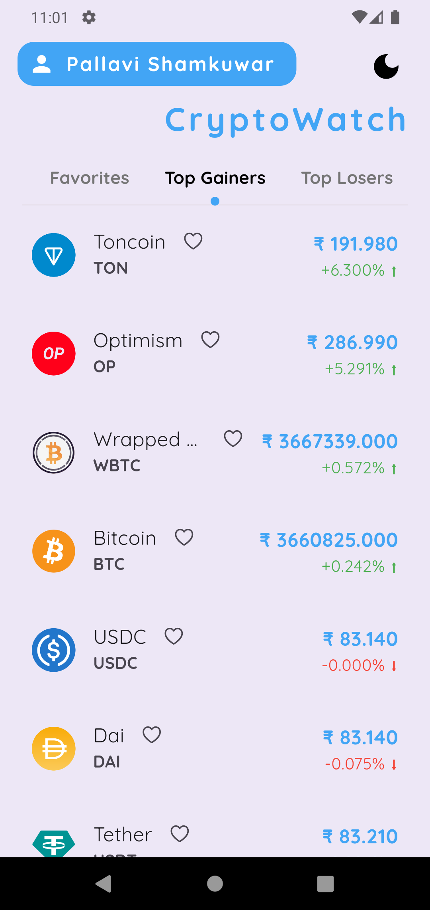

# Cryptotracking Application 

## Table of Contents
- Description
- Screen Recording
- Screenshots
- Features
- Getting Started

## Description
Welcome to the CryptoWatch Cryptotracking Application, a Flutter-based application developed as a technical assignment for the Mobile Application Development Intern position at Eighty7 Financials. This app aims to provide a user-friendly interface for keeping track of cryptocurrencies using the coingecko API.

The application utilizes the provider package for state management, ensuring an efficient and scalable approach to handling the application's state. With both light and dark theme, the application also allows the user to mark specific crytocurrencies as favourites for seamless monitoring.

## Screen Recording

https://github.com/SandSnorter/CryptoWatch-App/assets/121429638/721a33c7-9649-4d4c-9048-12e2517c4f28

## Screenshots

 

## Getting Started
To run the CryptoWatch Application on your local machine, follow these steps:

- Ensure you have Flutter installed. If not, follow the instructions in the - Flutter documentation to install Flutter.
- Clone this repository to your local machine.
- Open the project in your favorite IDE or editor.
- Run flutter pub get to install the required dependencies.
- Connect a device or start an emulator.
- Run flutter run to launch the application.
